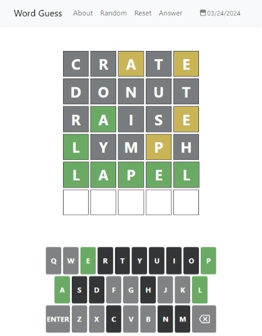
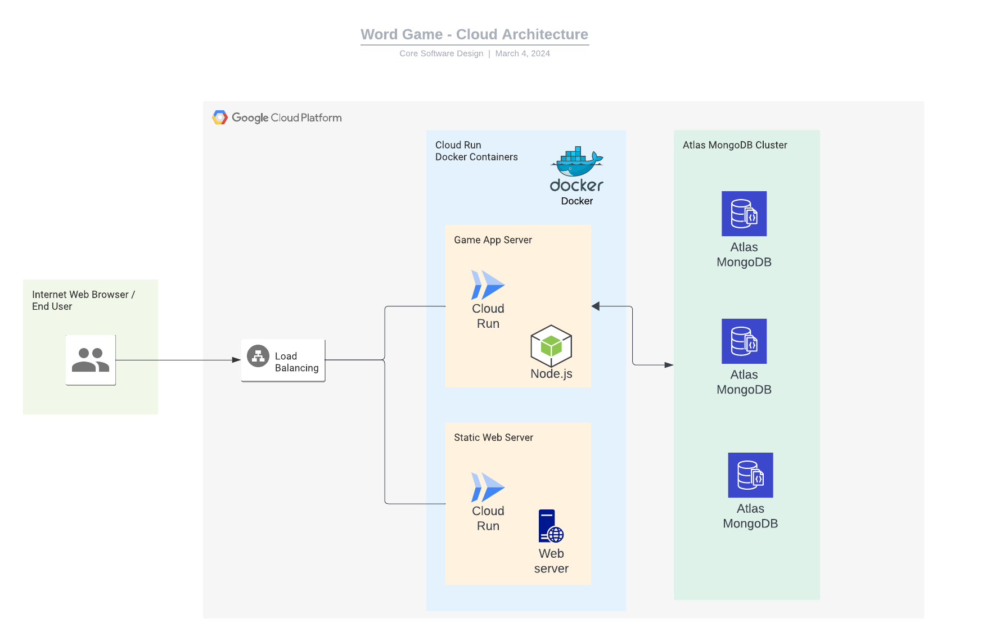
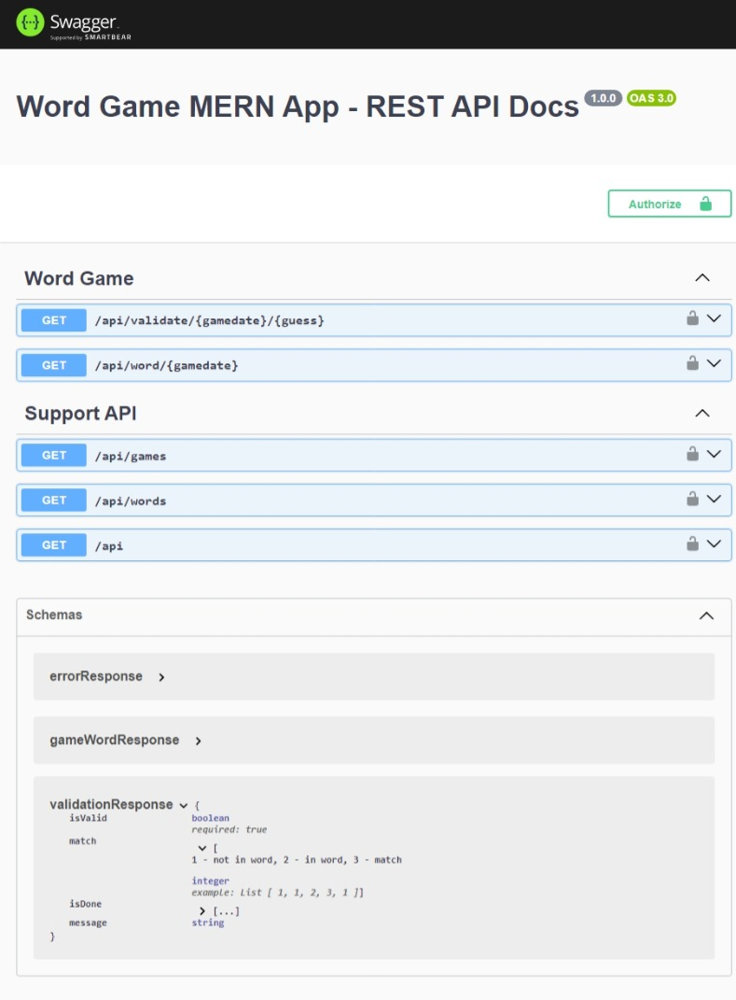
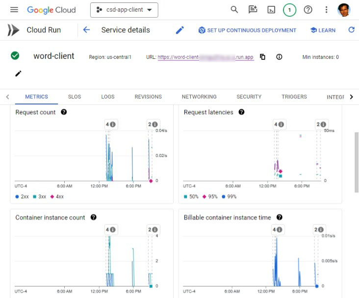

# Word Guess - MERN Tech Stack

**Word Guess** is built on the **MERN Tech Stack** (MongoDB, Express, React, Node). Word Guess is a functional clone of [**Wordle**](#wordle). Word Guess was created to explore new developments in serverless microservices and cloud architecture.

The application consists of three components: a React web client, a Node.js server, and a database. The client and server are deployed as **Docker Containers** to the **Google Cloud Platform Cloud Run** service. The **MongoDB Atlas** database cluster is hosted by on GCP cloud servers.

This GitHub repository contains both client and server source code. Live versions of the client and services are available.

| Layer  | Live Demo                                                                           |
| ------ | ----------------------------------------------------------------------------------- |
| Client | [Word Guess web app](https://word-client-dimgu2frlq-uc.a.run.app/)                  |
| Server | [Swagger UI / API Docs and Demo](https://word-server-h4acgw2v4q-uc.a.run.app/docs/) |

## Word Guess App UI



## MERN Tech Stack


The MERN tech stack is comprised of four frameworks:

- **MongoDB** — document database hosted on [MongoDB Atlas Database](https://www.mongodb.com/atlas)
- **Express(.js)** — Node.js web framework.
- **React(.js)** — a client-side JavaScript framework for UI.
- **Node(.js)** — a server-side JavaScript framework and web server.

Express and Node make up the middle (application) tier. Express.js is a server-side web framework, and Node.js is the popular JavaScript server platform.


## System Design



The web application is deployed on the **Google Cloud Platform (GCP)**. The application consists of a MongoDB database and two web containers. One container has the static website files and the other container has the Server API and the main game logic.

The front end is written with **React.js**. The static web site files are served by a Docker container based on a **NGINX/Alpine** layer.

The business logic is written with **Express/Node.js**. The app server provides the majority of the processing and is hosted in a separate container from the static web site to facilitate scaling. Swagger/OpenAPI is used to publish the API services.

The database is a three server **MongoDB Atlas Cluster** running on GCP virtual machines.

## Application Design

### Game Play

**Word Guess** is a clone of [Wordle](#wordle). The game's objective is to determine a five-letter word in six guesses or less. Each guess is validated and scored. Guesses are validated against a list of approximately 12,000 accepted words stored in the MongoDB database. Approximately 2,000 words are selected as answers by assigning a date to the "gamedate" property. There is a different answer for each date. The guesses are scored as follows:

Scoring

- Green - letter matches and is in correct position.
- Yellow - letter is in word but at a different position.
- Black - letter is not in the word.

### Database

The app stores the list of words in a MongoDB database collection. The word property has custom indexes to improve performance.

```
{
  _id: ObjectId('65daaa934cbce529d5790047'),
  word: 'cigar',
  gamedate: 2024-01-01T00:00:00.000Z
}
```

### Word Guess App Server

The core business logic is contained in the app server. The app server exposes the following HTTP web API:

- Validate guess.
- Get answer by date.
- Get all answers.
- Get all game dates and answers.

The server is written in Typescript and uses Express/Node.js frameworks. All APIs are covered 100% by unit and integration tests.

#### Swagger / OpenAPI

The server API is documented via OpenAPI source code annotations and published via Swagger UI. You can view and use the API directly via the [Live Swagger UI Docs Page](https://word-server-h4acgw2v4q-uc.a.run.app/docs/)



#### App Server API

Validation Response Properties:

- isValid: true if guess matches an approved word.
- message: contains validation failure messages.
- isDone: true if guess matches answer for given date (you won/game over flag).
- match: integer array containing the 'MatchStatus' of each letter in the guess.

```
const MatchStatus = {
  Invalid: -1,
  Unknown: 0,
  UnMatched: 1,
  InWord: 2,
  Matched: 3,
};
```

#### Sample API Requests

```xml
// test endpoint
http://localhost:5000/api/

// get list of all words
http://localhost:5000/api/words

// get list of all games and answers
http://localhost:5000/api/games

// get answer for a game date
http://localhost:5000/api/word/2024-02-25
{
    "word": "forth",
    "gamedate": "2024-02-25T00:00:00.000Z"
}

// validate correct guess
http://localhost:5000/api/validate/2024-02-25/forth
{
    "isValid": true,
    "match": [
        3,
        3,
        3,
        3,
        3
    ],
    "isDone": true
}

// validate wrong guess
http://localhost:5000/api/validate/2024-02-25/there
{
    "isValid": true,
    "match": [
        2,
        2,
        1,
        2,
        1
    ],
    "isDone": false
}

// validate - word not in list
http://localhost:5000/api/validate/2024-02-25/asdfg
{
    "message": "Not in word list",
    "isValid": false,
    "match": [
        -1,
        -1,
        -1,
        -1,
        -1
    ]
}

// validate - validate guess
http://localhost:5000/api/validate/2024-02-25/ther
{
    "message": "Not enough letters",
    "isValid": false,
    "match": [
        -1,
        -1,
        -1,
        -1,
        -1
    ]
}

// validate - validate game date
http://localhost:5000/api/validate/2024-02-2x5/there
{
    "isValid": false,
    "message": "Invalid game date",
    "match": [
        -1,
        -1,
        -1,
        -1,
        -1
    ]
}

```

### Word Guess Client

The front-end client is designed to be a lean, view-only **React.js** web application with minimal business logic. The client connects to the game server's API for all data. Traditional async fetch() calls are used for the client-side of the API.

The app leverages **React-Bootstrap** for mobile support and UI components. Bootstrap provides the Navbar and dialogs. The third party react-date-picker component provides the calendar date picker.

**Light and dark mode** support is provided via media queries and custom JavaScript.

**CSS** and **SVG** are used for animations.

The most challenging part of the front-end design was providing keyboard input without a traditional input text box. The main game-page 'keyPressDiv' has keyboard input enabled by applying the "tabIndex={0}" attribute. A useRef combined with useEffect() is used to keep keyboard focus on the div.

```javascript
// focus input to div on component load
useEffect(() => {
  keyPressDiv.current.focus();
}, []);
```

## Google Cloud Platform

The **Google Cloud Platform (GCP)** provides the **Cloud Run** service for scalable container deployment. Amazon AWS, Microsoft Azure, and other providers have similar services. GCP includes features such as dashboards, deployment management, and more.



## Wordle

This project is a clone of the popular game [Wordle](https://www.nytimes.com/games/wordle/). The original game was written by [Josh Wardle](https://en.wikipedia.org/wiki/Wordle). The game's original technical design was remarkable for its elegance and simplicity. The application ran only in the browser and was written with just HTML, CSS and vanilla JavaScript.

## Learn More

You can learn more at the [Core Software Design Website](https://www.coresoftwaredesign.com).
